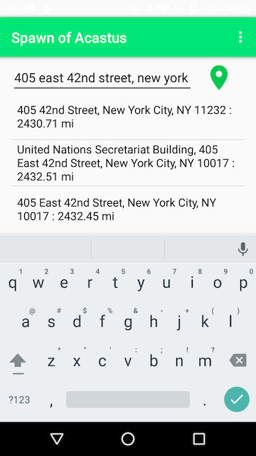
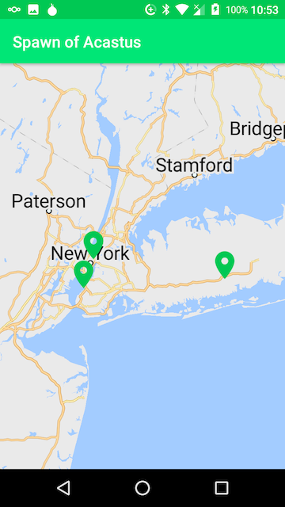
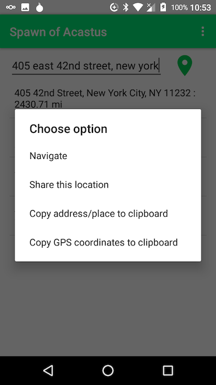

# Spawn of Acastus

## Background
### Acastus
[Acastus](https://github.com/DanielBarnett714/Acastus) is/was an open
source app for address lookup and sharing your location. It uses a
Pelias backend for address lookup and Mapzen for map display.
Unfortunately, the only public Pelias backend disappeared when Mapzen
ceased to exist so Acastus is not very useful at present.

Still, the source code is available and it is relatively easy to rewrite
the search routines to use other types of servers so there have been a
couple of spinoffs, including [Acastus
Photon](https://github.com/gjedeer/Acastus), so support of the original
author is encouraged. Donations to the original author can be made by
[Bitcoin](https://blockchain.info/address/1NjjuTxXm3ezpnVUGk4VmdEZUcym3SKZ8z) or
[PayPal](https://www.paypal.com/cgi-bin/webscr?cmd=_donations&business=VTUD5XRYMT686&lc=US&item_name=Acastus&currency_code=USD&bn=PP%2dDonationsBF%3abtn_donateCC_LG%2egif%3aNonHosted).

### AddressToGPS
[AddressToGPS](https://github.com/DanielBarnett714/AddressToGPS) is an
app that uses a web interface to Google to perform address lookups. This
is convenient for use with OSM based navigation apps like OsmAnd and
Maps.me that have limited address data and horrible address lookup
capability. Unfortunately, Google recently changed their backend and
AddressToGPS has been broken since then. As a library used by
AddressToGPS is no longer being update it is unlikely that AddressToGPS
will be fixed soon.

## Spawn of Acastus
This app has a very limited scope born out desire for a working app with
the functionality of AddressToGPS and a desire to have a way to inject
test addresses into a [microG](https://microg.org) geocoder backend.
* It is intended to be run on a phone that has [microG](https://microg.org) installed along with at least one microG address provider plug-in.
* It uses the Google API for address to lat/lon lookup.
* It uses the Google Maps API v2 for display of addresses found by the lookup.
* This app it does not have a valid Maps API key (microG ignores the key) so the map functionality does not work on most Android phones.
* Use of Google APIs can correctly be considered "anti-features" but is needed to work with [microG](https://microg.org).
* Quality of address parsing and lookup on this app depend on the microG address lookup backend that is enabled.

### Screenshots

